# life_cycler

这是一款致力于隐私保护的去中心化聊天微服务为生态中心的跨平台应用程序，让应用的控制权交由用户管理与控制。


## 特性

* 去中心化
* 微服务架构
* 布局自适应
* 可拓展插件化
* 二次开发且集成


## 目录结构


## 下载


## 数据库设计

### 用户表 (user)

用户表用来存储应用中所有用户的基本信息。

**字段说明**:

1. `id`: 用户的唯一标识符，通常是自增的整数。
2. `username`: 用户的用户名，必须是唯一的。
3. `email`: 用户的电子邮件地址，也必须是唯一的。
4. `password_hash`: 用户的密码哈希值，确保密码安全。
5. `created_at`: 账户创建时间戳。
6. `updated_at`: 用户信息的最近更新时间戳。
7. `profile_picture`: 用户的头像URL（可选）。
8. `status`: 用户当前的状态（在线、离线、勿扰等）（可选）

##### sql语句：

```sql
CREATE TABLE user (
    id SERIAL PRIMARY KEY,
    username VARCHAR(50) UNIQUE NOT NULL,
    email VARCHAR(100) UNIQUE NOT NULL,
    password_hash VARCHAR(255) NOT NULL,
    created_at TIMESTAMP DEFAULT CURRENT_TIMESTAMP,
    updated_at TIMESTAMP DEFAULT CURRENT_TIMESTAMP ON UPDATE CURRENT_TIMESTAMP,
    profile_picture VARCHAR(255),
    status VARCHAR(50)
);
```

### 消息表 (chat)

消息表用来存储应用中所有的聊天消息。

**字段说明**:

1. `id`: 消息的唯一标识符，通常是自增的整数。
2. `sender_id`: 发送消息的用户ID，外键关联到 `user` 表的 `id`。
3. `receiver_id`: 接收消息的用户ID，外键关联到 `user` 表的 `id`。如果是群组聊天，可以用此字段存储群组ID。
4. `content`: 消息的文本内容。
5. `created_at`: 消息发送的时间戳。
6. `is_read`: 表示消息是否已被接收者阅读。
7. `message_type`: 消息的类型（文本、图片、文件等）。

##### sql语句：

```sql
CREATE TABLE chat (
    id SERIAL PRIMARY KEY,
    sender_id INT NOT NULL REFERENCES user(id) ON DELETE CASCADE,
    receiver_id INT NOT NULL REFERENCES user(id) ON DELETE CASCADE,
    content TEXT NOT NULL,
    created_at TIMESTAMP DEFAULT CURRENT_TIMESTAMP,
    is_read BOOLEAN DEFAULT FALSE,
    message_type VARCHAR(50) DEFAULT 'text'
);
```

##### 表定义类

UserTable.dart 文件


ChatTable.dart文件


### 数据库设计细节与约束

1. **关系与外键**:
   - `chat` 表中的 `sender_id` 和 `receiver_id` 都是 `user` 表的外键，这样可以确保每条消息都有有效的发送者和接收者。
   - 使用 `ON DELETE CASCADE` 确保当用户被删除时，相关的消息也会被自动删除，避免孤立记录。
2. **索引**:
   - 为 `user` 表的 `username` 和 `email` 字段创建唯一索引，以确保这些字段的唯一性。
   - 为 `chat` 表中的 `sender_id` 和 `receiver_id` 创建索引，可以加快按用户查询消息的速度。
3. **时间戳**:
   - `created_at` 字段记录了记录的创建时间，这在消息排序和用户注册时间上非常重要。
   - `updated_at` 字段在 `user` 表中帮助记录最后的更新时间。
4. **数据安全与隐私**:
   - `password_hash` 存储用户密码的哈希值而不是明文，增强了安全性。
   - 对于聊天应用，保持数据的安全和隐私是至关重要的，确保对敏感数据的适当加密和保护。
5. **扩展性**:
   - 可以在 `user` 表中添加更多的字段以支持附加功能（如用户的偏好设置、个人描述等）。
   - 在 `chat` 表中，可以通过 `message_type` 字段扩展消息类型，以支持多媒体消息、文件等。


## websocket服务端设计

websocket server服务端处理总消息队列的策略

1. **被动触发**：在listen中监听到消息时被动立即转发该消息，不需要建立新的线程专门处理消息队列，容易造成阻塞
2. **循环任务**：建立新线程专门处理消息队列，优点在于不会造成阻塞，难点在于怎样处理线程之间的通信


##### client客户端扫描scan

client**端**

```json
{
	"type": "SCAN",
	"info": {
		"msg": "scan server task!"
	}
}
```

server端

```json
{
	"type": "SCAN",
	"info": {
		"code": 200,
		"msg": "I am server for websocket!"
	}
}
```

##### 客户端请求认证auth: 采用加密算法比较

```
算法规则: data_["info"]["key"] + data_["info"]["plait_text"]  使用md5加密生成encrypte
```

client端

```json
{
	"type": "AUTH",
	"deviceId": "设备唯一性id",
	"info": {
		"plait_text": "vsdvsbvsavsdvdxbdbdxbfdbsbvdfbd",
		"key": "this is auth key for encode"，
        "encrypte": "sjkvsbkjdvbsdjvhbsjhvbdsjhvbsdjhvbsdjhvbsdvjs"
	}
}
```

server端返回

```json
{
	"type": "AUTH",
	"info": {
		"code": "300",
		// 200 for successful !
		"msg": "this websocket client auth is not pass!"
	}
}

成功
{
	"type": "AUTH",
	"info": {
		"code": "200",
		// 代表成功
		"secret": secret,
		//通信秘钥
		"msg": "this websocket client auth is  pass!"
	}
}
```

##### 通讯方式：Queue队列存储形式


通讯秘钥认证失败

```json
{
	"type": "SECRET",
	"info": {
		"code": 400,
		"msg": "secret is not pass!"
	}
}
```

通用消息

```json
{
	"type": "MESSAGE",
	"info": {
        "msgType": "text", // 消息类型: text,file,link......
		"sender": {
			"id": "user123",// 设备唯一标识
			// 发送者的唯一标识符
			"username": "Alice",
            "role":  "角色", // admin(管理员), agent(坐席), moderator(版主), user(用户)
			// 发送者用户名
			"avatar": "avatar.jpg" // 发送者头像（可选）
		},
		"recipient": {
			"id": "all", // 设备唯一标识
			// 接收者的唯一标识符，可以是 all 表示广播给所有用户
			"type": "group" // 接收者类型，例如 group 表示群组消息，user 表示私聊消息
		},
		"content": {
			"text": "Hello, World!",
			// 文本消息内容
			"attachments": [ // 附件列表，如图片、文件等（可选）
			{
				"type": "image",
				"url": "https://example.com/image.jpg",
				"name": "image.jpg"
			}]
		},
		"timestamp": "2024-06-14T15:30:00Z",
		// 消息发送时间戳
		"metadata": {
			"messageId": "msg123",
			// 消息的唯一标识符
			"status": "sent" // 消息状态，例如 sent, delivered, read
		}
	}
}
```

##### 请求在线客户端client

client端发起请求

```
{
	"type": "REQUEST_INLINE_CLIENT",
	"info": {
		"deviceId": "",
		//请求客户端的设备唯一性id
	}
}
```

server端响应

```
{
	"type": "REQUEST_INLINE_CLIENT",
	"info": {
		"deviceId": [],// 在线设备唯一性id list，不包括本机deviceId
	}
}

```

##### server端主动广播在线的用户设计

- 触发点: 有新用户连接或有用户断开

- 函数设计：

  server广播

  ```dart
   // 数据封装
  Map msg = {
      "type": "BROADCAST_INLINE_CLIENT",
      "info": {"type": "list", "deviceIds": deviceIdList}
  };
  ```

- 关键代码

  ```dart
    Future<void> receiveInlineClients() async {
      print("******************处理从server接收到的在线client***********************");
      // 1.获取deviceId 列表
      List<String> deviceIdList = msgDataTypeMap["info"]["deviceIds"];
      // 2.与数据库中对比:剔除一部分
      List deviceIdListInDatabase = await userChat.selectAllUserChat();
      Set<String> deviceIdList_set = deviceIdList.toSet();
      Set<String> deviceIdListInDatabase_set =
          deviceIdListInDatabase.map((e) => e.toString()).toSet();
      // 集合取交集
      Set<String> commonDeviceIds =
          deviceIdList_set.intersection(deviceIdListInDatabase_set);
      // 3.将其存入缓存中
      List<String> commonList = commonDeviceIds.toList();
      GlobalManager.appCache.setStringList("deviceId_list", commonList);
      // 4.创建为每个clientObject对象，采用list存储
      for (String deviceId in commonList) {
        // 判断全局变量中是否存在该队列
        if (!GlobalManager.userMapMsgQueue.containsKey("")) {
          // 不存在，创建
          GlobalManager.userMapMsgQueue[deviceId] = MessageQueue();
        }
      }
  
      printInfo("userMapMsgQueue count:${GlobalManager.userMapMsgQueue.length}");
    }
  ```

  > 注: 根据该设计可知，以后聊天业务只需面向该map用户消息队列编程即可，便于解耦


##### 扫码加好友设计

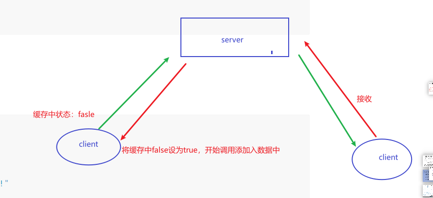


- 消息json设计

  ```json
   {
       "type": "REQUEST_SCAN_ADD_USER",
       "info": {
           "type":"", // 类型：request、response  请求方还是相应方
           "status": "", //状态: agree、disagree,wait  消息状态，用于标识
           "confirm_key": "确认秘钥", // 确认秘钥，用于验证相应方是否有效，
           // 发送方：扫码方
           "sender": {"id": send_deviceId, "username": qr_map["username"], "avatar": “头像"},
           // 接收方: 等待接受
           "recipient": {"id": qr_map["deviceId"], "username": AppConfig.username, "avatar": “头像"},
           // 留言
           "content": qr_map["msg"] // 这个字段不是二维码扫描出的，而是用户自定义加上去的
       }
   }
  ```

  


##### server消息任务调度设计

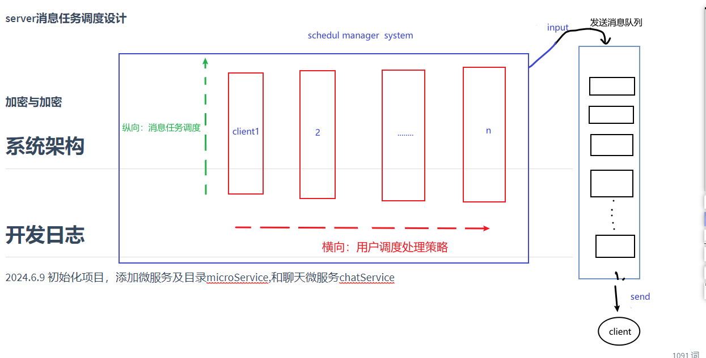**矩阵式调度client的消息进入总线的消息队列**

**调度策略：**

* **横向(client调度)**：按重要度进行调度选取（何为重要性则需要自行选取）
* **纵向(消息调度)**：单个client客户端消息队列设计，一般采用时间先后顺序。

创新调度方法：采用人工智能调度

##### 总消息队列设计

* **在线client消息队列**
* **离线client消息队列**：负责各类的离线信息调度，进入其消息队列的**msg的info字段已进行加密处理**

> 根据message所标识的接受者信息[这里采用设备的唯一id作为依据]选择其对应clientObject对象，
> 这里有个策略选择：如果接受者处于断线状态怎么处理，如下策略解决，推荐策略1，这里选择权交给用户，用户自行选择策略
> 策略1: 采用建立一个离线状态信息的循环队列用于被动发送/主动发送，这里最好的策略为在用户连接成功server端后调用该循环信息队列,这会增加server端的存储压力
>   策略2:采用互信机制，只能在双方都处于在线状态时才能进行通讯，

关于离线消息队列两个核心点：

* 未在在线clientObject中找到的消息clientObject**是否进入离校消息队列**中
* **是否开启离线消息队列**，这里采用策略被动触发离线消息队列处理机制

##### 进入离线消息队列msg需要满足的字段条件：

```json
 {
     "type":"",
     "info":{
         // 接收者
         "recipient":{
             "id":"设备唯一性ID"
             .......
         },
         ........
     }
 }
```

##### 离线消息加密设计：两道加密防护


- 第一道：内存加密存储防护，自定义秘钥为key为该机的唯一性设备标识符作为加密秘钥key
- 第二道：传输解密防护,双方互信生成的秘钥key

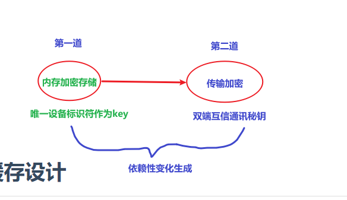


##### Client端接收好友添加消息队列


##### 加密与加密

## 消息页面缓存设计

为每个通讯对象实体(普通用户、群主)设计一个用于缓存新消息的队列。只需要面向队列变成即可。

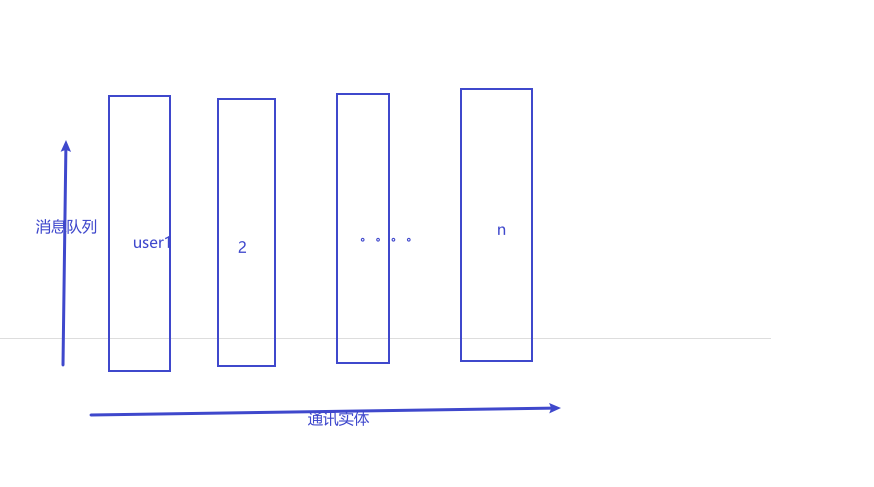


应用启动时，根据拥有用户数创建消息队列，关闭应用时清空消息队列


### server端作为client设计

##### 方案

- **方案一**(**目前方案**): 本地重启一个client客户端实例，server与client服务分离

  好处： 有力减少server与client的耦合，跟有利于分别维护server与client的代码，简单

  缺点:  增加server的中心设备的性能压力，不太推荐

  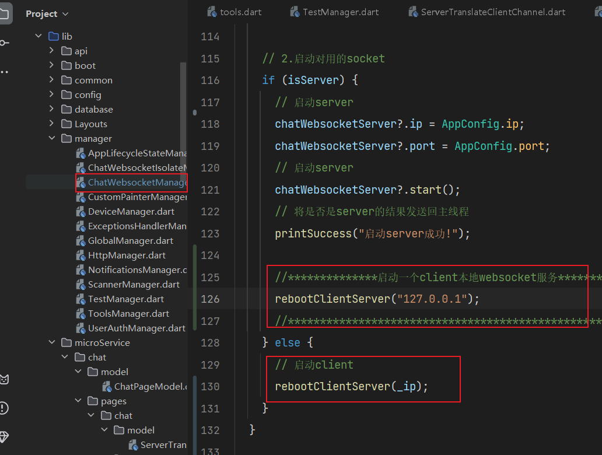

- **方案二**(推荐,后续方案): 共用server的websokcet，但是需要修改部分代码，这里需要设计server与client的桥接通道类

  好处: 只需要利用server的websocket与client的通讯，有力较少其中心设备的能耗

  坏处: 其造成server与client代码交织在一起，耦合性强

  > 解决方法: 通过合理的代码设计有力较少server与client的代码耦合性

​		通过重写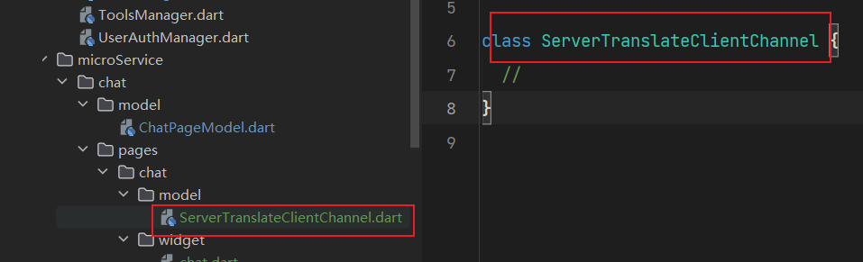

**要点：**

1. 消息不需要加解密
2. 采用原client基础上通过判断的方式
3. 

​		


## 进度计划

- [ ] 通讯项目暂时停止：等待另外一部手机来测试
- [ ] 目前任务点或难点

1. 如何解决设备作为server端时，如何承担client的任务
2. 数据库插入测试验证：扫码加好友、发送信息接收更新显示、表情打开、图片与文件类型等显示

以上暂时搁置，接下来开发其他模块应用

- [ ] 密码本
- [ ] 记账本
- [ ] 待办事项
- [ ] 打卡事务

## 任务计划app设计与开发

两个页面：

- 首页：展示当日的任务清单展示
- 待办日历：用于展示任务计划的时间跨度等信息，便于查询

数据结构设计

分出实体：待办任务、具体日、

#### 数据存储设计

###### 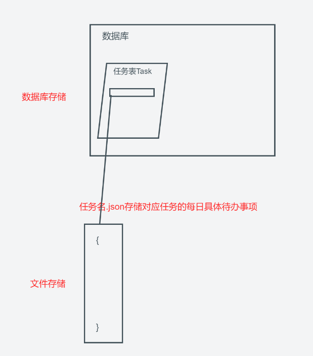

###### 数据库设计

- **任务表Tasks**

  | 字段名                  | 类型   | 说明                                                         |
  | ----------------------- | ------ | ------------------------------------------------------------ |
  | 任务ID(taskID)          | String | 保证ID其唯一性                                               |
  | 用户ID(userID)          | String | 本地存储时不重要                                             |
  | 任务名(name)            | String | 用户自定义                                                   |
  | 标签(label)             | String | 多个标签时用\|分割开                                         |
  | 分类(category)          | String | 该分类根据用户自定义的进行分类，与分类表关联                 |
  | 描述(description)       | text   | 用户自定义描述                                               |
  | 级别(priority)          | string | 三个级别:low  medium high                                    |
  | 状态(status)            | string | 三个状态: pending(待定)、in progress(进行中)、completed（完成） |
  | 创建时间(createAt)      | Date   |                                                              |
  | 更新时间（updateAt）    | Date   |                                                              |
  | 开始执行时间(startTime) | Date   |                                                              |
  | 结束执行时间(endTime)   | Date   |                                                              |

  drift代码实现

  ```dart
  class Tasks extends Table {
    IntColumn get id => integer().autoIncrement()();  // 自增id字段
    TextColumn get taskId => text().customConstraint('UNIQUE')();  // 任务ID，保证唯一性
    TextColumn get userId => text().nullable()();  // 用户ID，本地存储时不重要
    TextColumn get name => text().withLength(min: 1, max: 255)();  // 任务名，用户自定义
    TextColumn get label => text().nullable()();  // 标签，多个标签用 | 分割
    TextColumn get category => text().nullable()();  // 分类，根据用户自定义的进行分类
    TextColumn get description => text().nullable()();  // 描述，用户自定义描述
    TextColumn get priority => text().withLength(min: 1, max: 10)();  // 级别，三个级别: low, medium, high
    TextColumn get status => text().withLength(min: 1, max: 15)();  // 状态，三个状态: pending（待定）、in progress（进行中）、completed（完成）
    DateTimeColumn get createAt => dateTime().nullable()();  // 创建时间
    DateTimeColumn get updateAt => dateTime().nullable()();  // 更新时间
    DateTimeColumn get startTime => dateTime().nullable()();  // 开始执行时间
    DateTimeColumn get endTime => dateTime().nullable()();  // 结束执行时间
  
    @override
    Set<Column> get primaryKey => {id};
  }
  ```

###### 文件存储设计

- 文件名规定：***task_{taskId}*.json**    对应任务表Tasks中的**name字段**名

- json结构设计:

  ```json
  {
     "taskID":"对应任务的taskID",
     "taskName":"对应的task名",
     "data": [// 其中data为数组形式，每个item为Map对象，对应该任务的每日待办事项
    		{
    		  "todoID": "待办事项的唯一ID",
      	  "name":"事项名",
      	  "description": "描述",
    		  "createAt": "创建时间", // 以毫秒整数进行存储
    		  "updateAt": "更新时间", // 以毫秒整数进行存储
    		  "duration": "待办事项时长", // 该优先级低于下面的严格执行时间点：分钟，int
    		  "startTime": "开始执行时间", // 以毫秒整数进行存储
    		  "endTime": "结束时间", // 以毫秒整数进行存储
    		// 从开始之日起记录每日该todo的完成情况(只记录执行的，没执行的日期不记录)，按时间顺序依次往下
    		  "executiveLog":[
    		  	{
    		  	   "time":"该日的时间",// 只需记录到年月日即可
    		  	   "duration": "完成待办事项时长",   // 分钟整数
                 "startTime": "执行待办事项开始时间", // 以毫秒整数进行存储
                 "endTime": "执行待办事项结束时间", // 以毫秒整数进行存储
                 "status": "", // 完成情况: giveUp(主动放弃) completed(完成) interrupt(中断，指任务已进行但为100%完成只是完成部分)
                 "tip": "", // 用户标记: 主要给用户提供比如情绪等标记
                 "notes":"" // 用户记录：猪腰提供给用户在完成该任务或其他情况需要用户自定义该日todo事项的说明与记录
    		  	},
    		  	......该todo其他日期.........
    		  ]
    		},
    		..........其他todo...........
    ]
  }
  ```

#### 代码设计

##### 系统设计(架构设计)

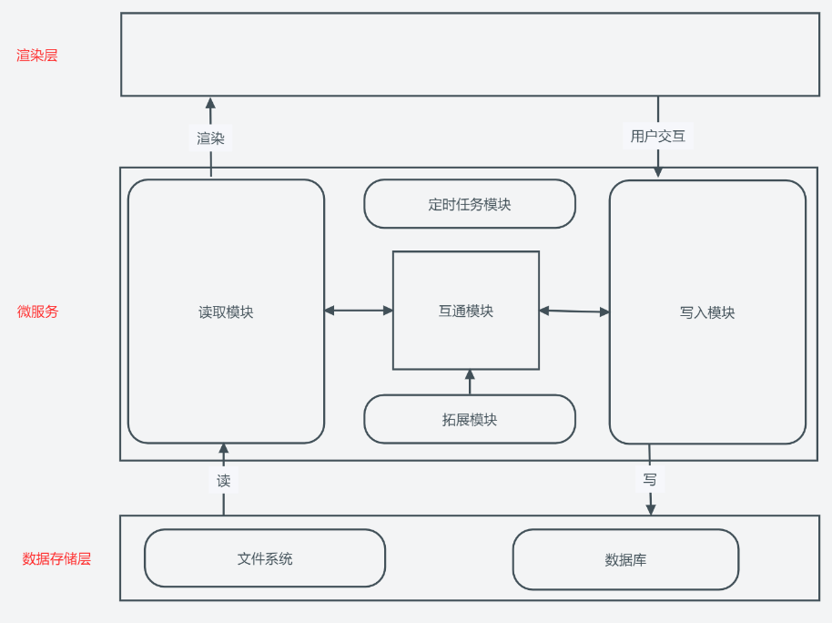

##### UI页面设计

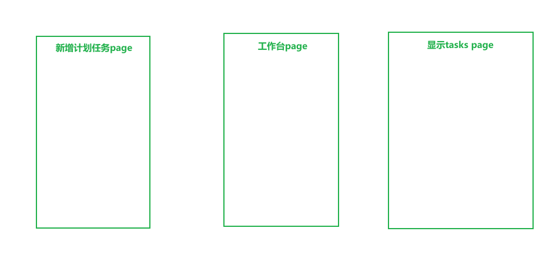

##### 模型设计

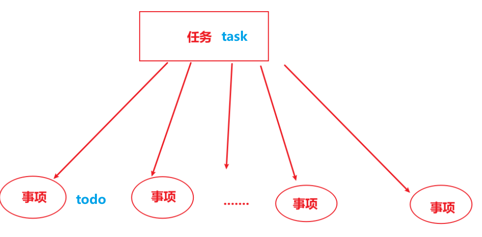


##### 目录结构

```markdown
├─module          ---------业务逻辑模块
├─page			  ---------页面	
├─widget		  ---------组件
└─main.dart		  ---------入口
```

##### 所需技术栈(技术攻关点)

- [x] 数据库sqlite： 主要为创建数据库表

  采用drift本地可持续化

  **核心代码：**

  - 定义数据库表

    ```dart
    class Tasks extends Table {
      IntColumn get id => integer().autoIncrement()();  // 自增id字段
      TextColumn get taskId => text().customConstraint('UNIQUE')();  // 任务ID，保证唯一性
      TextColumn get userId => text().nullable()();  // 用户ID，本地存储时不重要
      TextColumn get name => text().withLength(min: 1, max: 255)();  // 任务名，用户自定义
      TextColumn get label => text().nullable()();  // 标签，多个标签用 | 分割
      TextColumn get category => text().nullable()();  // 分类，根据用户自定义的进行分类
      TextColumn get description => text().nullable()();  // 描述，用户自定义描述
      TextColumn get priority => text().withLength(min: 1, max: 10)();  // 级别，三个级别: low, medium, high
      TextColumn get status => text().withLength(min: 1, max: 15)();  // 状态，三个状态: pending（待定）、in progress（进行中）、completed（完成）
      DateTimeColumn get createAt => dateTime().nullable()();  // 创建时间
      DateTimeColumn get updateAt => dateTime().nullable()();  // 更新时间
      DateTimeColumn get startTime => dateTime().nullable()();  // 开始执行时间
      DateTimeColumn get endTime => dateTime().nullable()();  // 结束执行时间
    
      @override
      Set<Column> get primaryKey => {id};
    }
    ```

  - 执行生成的数据库表的命令:

    ```shell
    flutter pub run build_runner build
    ```

  - 编写对应DAO：文件名**TaskDao.dart**

    ```dart
    /*
    desc: TaskDao类DAO操作: DAO类集中管理 CRUD 操作
    */
    import 'package:app_template/database/LocalStorage.dart';
    import 'package:app_template/database/daos/BaseDao.dart';
    import 'package:drift/drift.dart';
    import '../../manager/GlobalManager.dart';
    import '../../microService/chat/websocket/common/Console.dart';
    
    class TaskDao extends BaseDao with Console {
    
    
      // 获取所有任务task
      Future<List<Task>> selectAllTasks() async {
        // 构建查询
        List<User> query = await (db.select(db.tasks)).get();
    
        // 将查询结果转换为 User 的列表
        return query;
      }
       
    
      // 获取任务task，分页查询，按时间查询
      Future<List> selectTaskByPage(int page, int pageNum) {
        /*
          page: 页面 1,2.。。。
          pageNum: 每页数量
         */
        final offset = (page - 1) * pageNum;
        // 构建查询
        final query = (db.select(db.tasks)
              ..orderBy([
                (t) =>
                    OrderingTerm(expression: t.createdAt, mode: OrderingMode.desc)
              ])
              ..limit(pageNum, offset: offset))
            .get();
    
        // 将查询结果转换为 Task 的列表
        return query;
      }
    
      // 插入任务task数据
      Future<bool> insertTask(TasksCompanion tasksCompanion) async {
        try {
          await db.into(db.tasks).insert(tasksCompanion);
          return true; // 插入成功，返回 true
        } catch (e, stacktrace) {
          printCatch("用户插入失败: $e");
          printCatch("Stacktrace: $stacktrace");
          return false;
        }
      }
    
      // 更新task数据
      updateTask(TasksCompanion tasksCompanion) async {
        int result = 0;
        await db.update(db.tasks)
          ..where((tbl) => tbl.id.equals(tasksCompanion.taskId))
          ..write(usersCompanion).then((value) {
            print("update result: $value");
            result = value;
          });
    
        return result;
      }
    
      // 删除数据
      int deleteTask(TasksCompanion tasksCompanion) {
        // 删除条数
        int result = 0;
        db.delete(db.tasks)
          ..where((tbl) => tbl.id.equals(tasksCompanion.taskId))
          ..go().then((value) {
            print("delete data count: $value");
            result = value;
          });
    
        return result;
      }
    }
    ```

- [ ] 本地文件操作：读取与写入更新等，主要设计到**json读取和文件存储位置**

  技术栈选型:

  - 文件操作类库：**文件监听库推荐watcher** 用法https://github.com/dart-lang/watcher/blob/master/example/watch.dart

    利用path_provider库获取应用数据存储目录：

    ```
    // 获取应用数据存储目录路径
    final Directory appDocumentsDir = await getApplicationDocumentsDirectory();
    
    // 在该目录下创建tasks目录用于存储对应的json文件: 采用name_plus库
    Directory('path').namePlus('filename'); // 同步
    Directory('path').namePlusSync('filename');// 异步
    
    // 创建json文件
    File('path').namePlus('filename');// 同步
    File('path').namePlusSync('filename');// 异步
    ```

  - json文件读取与写入操作库：

    读取并解析json

    ```dart
    // 采用deep_pick类库进行json的解析：这里采用Pick deep nested values without parsing all objects in between
    
    final String? version = pick(json, 'meta', 'version', 'commit').asStringOrNull();
    ```

    写入json文件并存储

    ```dart
     // 读取文件
      final file = File('path/to/your/file.json');
      if (!await file.exists()) {
        print('文件不存在');
        return;
      }
      final contents = await file.readAsString();
      
      // 解析JSON数据
      Map<String, dynamic> jsonData = jsonDecode(contents);
    
      // 修改JSON数据中的值
      jsonData['key'] = 'newValue';
    
      // 将修改后的JSON数据写回文件
      await file.writeAsString(jsonEncode(jsonData));
      
      print('JSON文件已成功修改并保存');
    ```

- [ ] 定时任务：核心

  - 后台执行任务库：workmanager 或者flutter_background_service(推荐)

    与cron配合共同执行

  - 定时任务执行库:   cron

    定时任务主要执行逻辑为：主要从事todo待办事项的任务开始结束时的提醒工作（只是提醒不参与todo的执行时长任务,交由用户UI交互执行)：比如利用flutter_local_notifications或者用户自设定的提醒方式

- [ ] 功能拓展设计

  - 通过用户设定的提醒闹钟：利用插件android_alarm_manager_plus
  
  主要考验代码编写的解耦如何，每个功能模块各自独立

#### 项目执行规划（先完成基本雏形，再后续新增完善与修正）

1. 业务需求分析与梳理
2. 系统设计
3. 项目实施
   - [ ] 目录创建: 创建上述设计好的目录
   - [ ] 数据库创建：主要用到定义数据库表、执行创建数据表命令、编写对应表的DAO数据库操作逻辑
   - [ ] 编写页面UI：主要在page和widget目录进行
   - [ ] 编写对应的页面的业务功能模块：主要在module目录进行
   - [ ] 整合
4. 调试与测试，反馈自1步骤循环进行不断修正
5. 整合与部署


#### 项目执行日志记录

- 2024.7.5 增加新增taskUI

  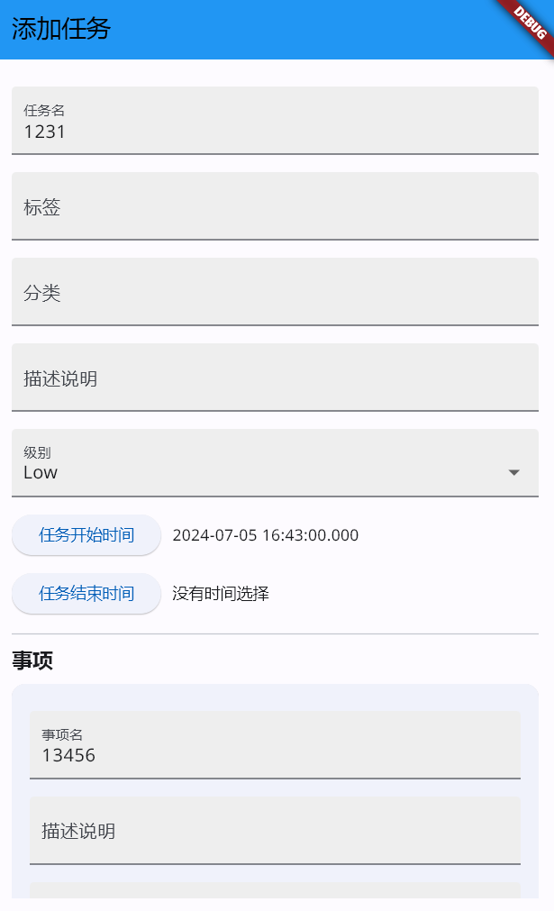


## 系统架构


## 开发日志
2024.6.9 初始化项目，添加微服务及目录microService,和聊天微服务chatService


**任务提示**

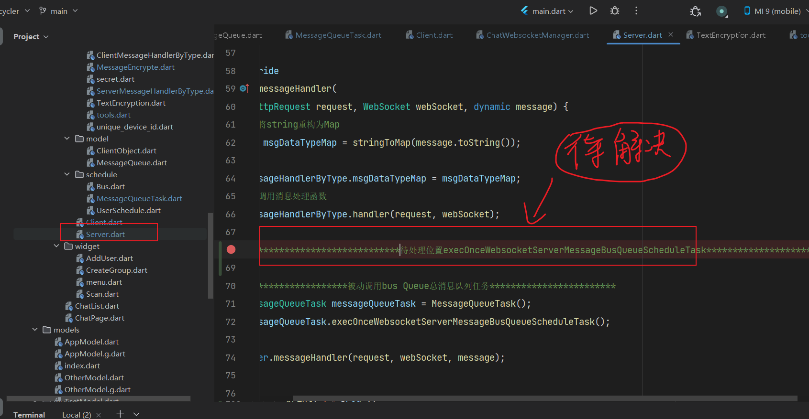

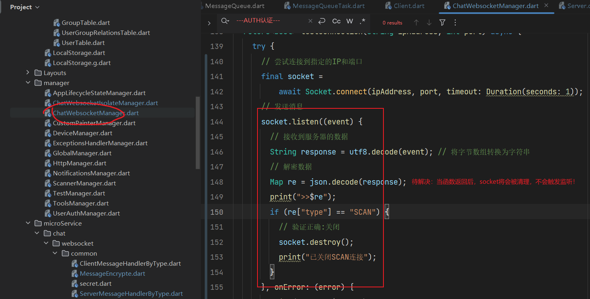

**优化的点**：client检测server可采用先验证ip存在性，在测试websocket连接，因为ip分配一般都是顺序性分配的
